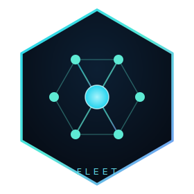

  

<h1 align="center">sarthak&#8209;fleet</h1>

  <strong>A fleet of AI&#8209;native products. One hub. One workspace.</strong>

  <em>Building the rails AI runs on — and the products that ride them.</em>

  
  
  
  
  

  <a href="https://sassmaker.com"><b>Foundry</b></a> &nbsp;·&nbsp;
  <a href="https://sassmaker.com/factory"><b>Factory map</b></a> &nbsp;·&nbsp;
  <a href="https://github.com/sarthakagrawal927"><b>Creator</b></a>

---

**28 products** across AI infrastructure, developer tools, and consumer apps — each its own repository, all coordinated through one system-of-record. Two shared layers carry the load: **saas-maker** (the Foundry — registry, SDKs, widgets, APIs) and **free-ai** (an OpenAI-compatible gateway over 30+ free LLM providers). Everything else is a product built on top — standalone, each drawing only the utilities it needs.

> 🏭 See the live **[Factory map](https://sassmaker.com/factory)** for how it all connects.

### 🛰 Platform & shared infra

- **[saas-maker](https://github.com/sarthak-fleet/saas-maker)** — the Foundry: system-of-record, SDKs, widgets, CF API + cockpit · [sassmaker.com](https://sassmaker.com)
- **[free-ai](https://github.com/sarthak-fleet/free-ai)** — OpenAI-compatible LLM gateway fronting 30+ free providers
- **[knowledge-base](https://github.com/sarthak-fleet/knowledge-base)** — RAG service: retrieval, entity extraction, cited answers

### 🧰 AI infra & dev tools

- **[codevetter](https://github.com/sarthak-fleet/codevetter)** — desktop AI code review · [codevetter.com](https://codevetter.com)
- **[tinygpt](https://github.com/sarthak-fleet/tinygpt)** — local LLM factory + runtime (Mac/MLX) + WebGPU playground
- **[starboard](https://github.com/sarthak-fleet/starboard)** — GitHub stars organizer + semantic search
- **[reel-pipeline](https://github.com/sarthak-fleet/reel-pipeline)** — AI short-form video generation pipeline
- **[pace](https://github.com/sarthak-fleet/pace)** — on-device Mac voice agent that reads your screen

### 🚀 Products & SaaS

- **[high-signal](https://github.com/sarthak-fleet/high-signal)** — daily synthesized intelligence brief · [highsignal.app](https://highsignal.app)
- **[karte](https://github.com/sarthak-fleet/karte)** — AI link-in-bio: chat, encyclopedia, roast · [karte.cc](https://karte.cc)
- **[rolepatch](https://github.com/sarthak-fleet/rolepatch)** — LaTeX resume editor with AI job tailoring · [rolepatch.com](https://rolepatch.com)
- **[truehire](https://github.com/sarthak-fleet/truehire)** — verified-candidate GitHub scoring
- **[reader](https://github.com/sarthak-fleet/reader)** — research library: capture, annotate, AI-chat
- **[email-manager](https://github.com/sarthak-fleet/email-manager)** — Gmail workspace with local semantic search
- **[everythingrated](https://github.com/sarthak-fleet/everythingrated)** — multi-axis ratings platform
- **[significanthobbies](https://github.com/sarthak-fleet/significanthobbies)** — hobby discovery + journaling · [significanthobbies.com](https://significanthobbies.com)
- **[today-little-log](https://github.com/sarthak-fleet/today-little-log)** — personal life PWA: scoreboard, rituals, habits
- **[looptv](https://github.com/sarthak-fleet/looptv)** — TV-style random video player
- **[materia](https://github.com/sarthak-fleet/materia)** — evidence-graded herbs/supplements/drugs explorer
- **[verified-bases](https://github.com/sarthak-fleet/verified-bases)** — storefront for verified software starter Bases
- **[drank](https://github.com/sarthak-fleet/drank)** — Ahrefs Domain Rating tracker, 100% client-side

### 🎮 Apps & experiments

- **[ai-game](https://github.com/sarthak-fleet/ai-game)** — 3D AI world simulator with NPC agents · [aliveville.com](https://aliveville.com)
- **[open-historia](https://github.com/sarthak-fleet/open-historia)** — AI grand-strategy history game
- **[anime-list](https://github.com/sarthak-fleet/anime-list)** — anime/manga discovery with multi-axis filtering
- **[taste](https://github.com/sarthak-fleet/taste)** — ShipRank: pre-A/B / screenshot ranking for teams

### 🔬 Research & learning

- **[forecast-lab](https://github.com/sarthak-fleet/forecast-lab)** — eval-first ML lab: forecasting + recsys benchmarks
- **[research-papers](https://github.com/sarthak-fleet/research-papers)** — academic paper platform (488k papers, semantic search)
- **[swe-interview-prep](https://github.com/sarthak-fleet/swe-interview-prep)** — SWE learning OS with FSRS spaced repetition

---

<h3 align="center">Built by</h3>

  <strong><a href="https://github.com/sarthakagrawal927">Sarthak Agrawal</a></strong> — AI infrastructure + product engineer. 
  <a href="https://sarthakagrawal.dev">sarthakagrawal.dev</a> ·
  <a href="https://x.com/sarthakcodes">@sarthakcodes</a> ·
  <a href="https://linkedin.com/in/sarthakagrawal927">LinkedIn</a>

Personal &amp; OSS repos live on <a href="https://github.com/sarthakagrawal927">@sarthakagrawal927</a>.

